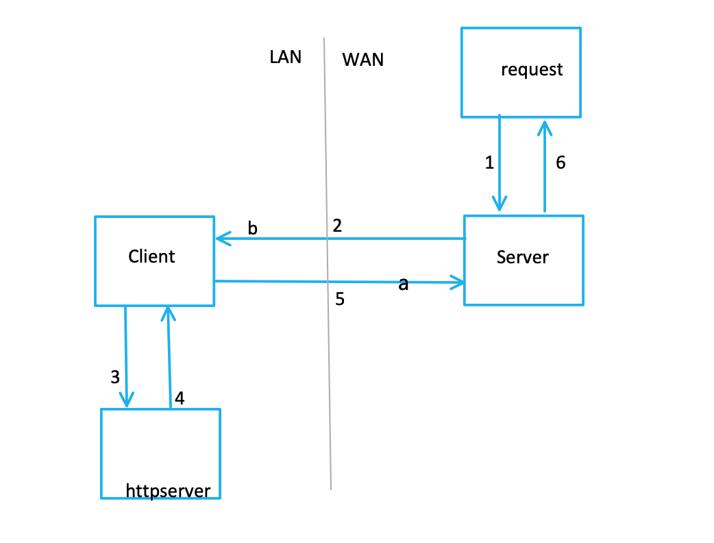
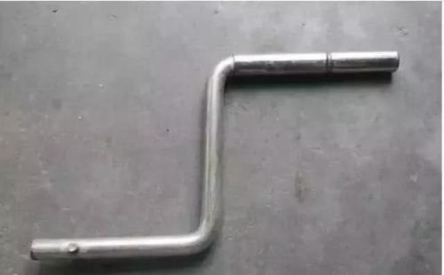

# Crank

A tunnel tool, allow you request your inside http server from outside. A reverse proxy.

It's funny it looks like a **crank**:

## Test:

1. Start server from you localhost:`python crank_server.py`

2. start client:`python crank_server.py`

3. start a simple http server: `python3 -m http.server`

4. try request through crank_server:`curl http://127.0.0.1:3457/` 

you can see a web page just like http://127.0.0.1:8000/

## Real Usage:

1. Start server from you vps: `python crank_server.py`

2. change the server_address in `crank_server.py`, and your http server port like:

`crank = CrankClient(('server_address', 3456), ('127.0.0.1', your_port))`

3. start client:`python crank_server.py`

Now, you can make request from your vps to view your inside http server!

4. try request through crank_server:`curl http://127.0.0.1:3457/path/to/file.php`

